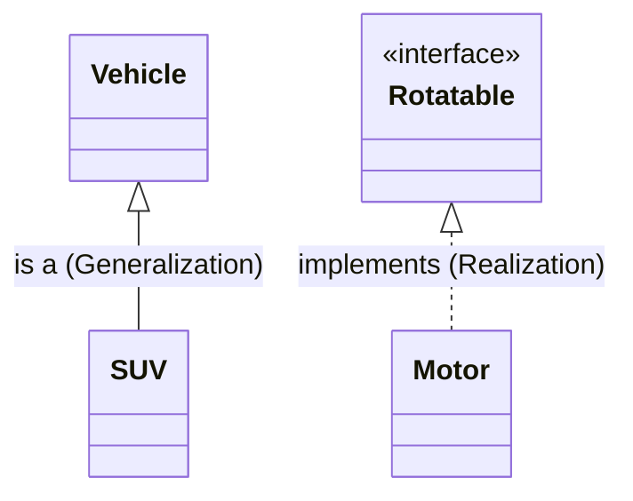
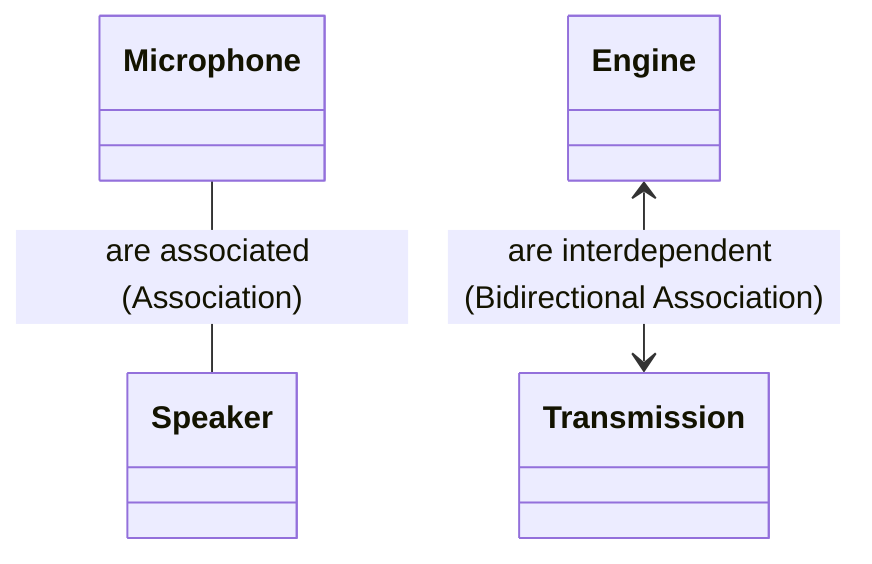
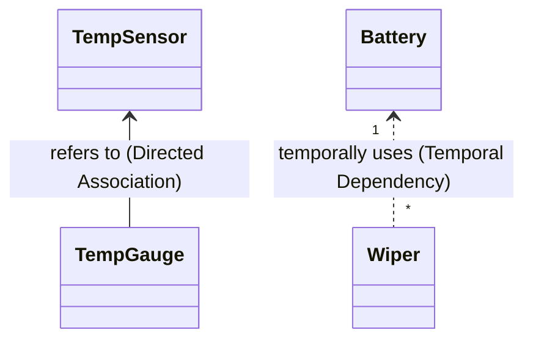
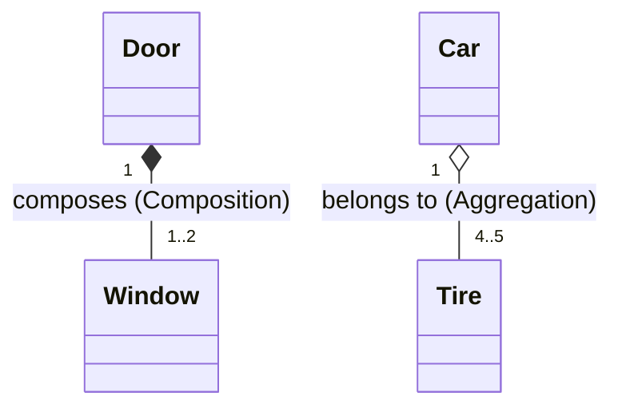

# Class Diagram Cheat Sheet

# Description 

| Notation | Coupling | Term | Reading | Explanation |
|------|------|--------|------|------|
| `--｜>` | High | Generalization | is a | Inheritance relationship; a subclass inherits functionality from a superclass; conversely, a generalization relationship. |
| `..｜>` | Low | Realization | implements | Implementation of an interface; some languages prefix interfaces with `I`, e.g., `IMotor`. |
| `--` | Mid | Association | are associated | Some kind of relationship; direction is ambiguous, so not recommended. |
| `<-->` | High | Association | are interdependent | Bidirectional relationship; they reference each other; introduce an interface to achieve loose coupling. |
| `-->` | Mid | Directed Association | refers to | Unidirectional relationship; the referrer → the referent. |
| `..>` | Low | Temporary Dependency | uses | Temporary dependency; uses but does not own. |
| `--*` | High | Composition | composes | Strong ownership; when the whole is destroyed, the parts are also destroyed. |
| `--o` | Mid | Aggregation | belongs to | Weak ownership; parts remain if the whole is destroyed; relationship is ambiguous, so not recommended. |

# 解説

| 記法 | 結合度| 用語 | 読み方 | 解説 |
|------|------|--------|------|------|
| `—｜>` | High | 継承 | is a | 継承関係。 子クラスが親クラスの機能を継承する。逆に見れば汎化関係となる。 |
| `..｜>` | Low |  実現 | implements | インターフェースの実装 言語によってはIMotorのように接頭子Iをつける。|
| `—`    | Mid | 関連 | are associated | なんらかの関連。 方向性が曖昧なので非推奨。|
| `<—>`  | High | 双方向関連 | are interdependent | 双方向に関連する。 互い参照し合う。I/Fを入れて疎結合にすべき。|
| `—>`   | Mid | 片方向間連 | refers to  | 片方向に関連する。 参照する側→される側。|
| `..>`   | Low| 一時的依存 | uses | 一時的な依存関係。使用するが所有しない。|
| `—*`   | High | コンポジション | composes | 強い所有関係。全体が消えると部分も消える。|
| `—o`   | Mid | 集約 | belongs to | 弱い所有関係。全体が消えても部分は残る。 関係が曖昧なので非推奨。|

