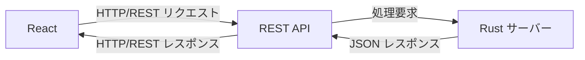

# Rust と React と REST — 詳細レポート

このレポートは **Rust**, **React**, **REST** の概要を略称の由来、歴史、典型的な構文、公式提供者・サイト、プラットフォーム、応用範囲・特記事項の順で整理したものです。  
A4 2 枚に収まるようシンプルにまとめています。

---

## Rust

### 1) 略称の由来
Rust は “腐食” を意味する言葉で、もともと Mozilla の Graydon Hoare 氏が命名。  
単語自体に深い意味はなく、短く覚えやすい名前。

### 2) 歴史
- 2010 年頃に Mozilla Research で開発開始。
- 2015 年 Rust 1.0 リリース。
- その後コミュニティ主体で進化。

### 3) 応用範囲
- 高速・安全なシステムプログラム
- Web サーバー（API など）
- 組み込み・ CLI ツール
- ゲームエンジン / WebAssembly への利用

### 4) 典型的な構文

```rust
fn main() {
    println!("Hello, world!");
}

// 関数例: 2 つの整数を足す
fn add(x: i32, y: i32) -> i32 {
    x + y
}
```

5) 公式提供者・公式サイト・ドキュメント
	•	提供者: Rust プロジェクト・コミュニティ
	•	公式サイト: https://www.rust-lang.org/
	•	ドキュメント: https://doc.rust-lang.org/

6) プラットフォーム
	•	クロスプラットフォーム（Linux / macOS / Windows）
	•	WebAssembly（wasm）ターゲットあり

7) その他特記事項
	•	所有権システムにより安全性が高い
	•	GC（ガベージコレクション）なし／コンパイル時保証多
	•	Cargo（パッケージ管理）が優秀

REST

1) 略称の由来

REST は Representational State Transfer の略。
要素：Representation（表現）、State（状態）、Transfer（転送）。

2) 歴史
	•	2000 年、Roy Fielding 博士の博士論文で提唱
	•	Web の設計原則のひとつとして位置づけられる

3) 応用範囲
	•	Web API 設計全般
	•	サーバー ⇄ クライアント通信ルール
	•	HTTP を用いた CRUD 操作

4) 典型的な構文（HTTP 例）

操作	HTTP メソッド	リソース
取得	GET	/items
作成	POST	/items
更新	PUT/PATCH	/items/1
削除	DELETE	/items/1

例：

GET /users/42 HTTP/1.1
Host: api.example.com

5) 公式提供者・公式サイト・ドキュメント
	•	標準仕様は存在せず、HTTP をベースに設計指針として使われる
	•	代表的なガイドライン：REST API Tutorial, RFC 7231 など

6) プラットフォーム
	•	HTTP を扱える全てのクライアント・サーバー

7) その他特記事項
	•	ステートレス（状態をセッションに持たない）
	•	URI 設計が重要
	•	JSON がよく使われるが形式は任意

React

1) 略称の由来

React は “反応する” を意味する動詞 React から。
UI が状態変化に “反応する” という意味。

2) 歴史
	•	2013 年に Facebook（現 Meta） が公開
	•	コンポーネントベース UI の主流化に貢献

3) 応用範囲
	•	Web フロントエンド
	•	React Native を用いたモバイルアプリ
	•	SPA（Single Page Application）

4) 典型的な構文

```js
import React from 'react';

function App() {
  return <h1>Hello, React!</h1>;
}

export default App;
```


状態を扱う例：

```js
import { useState } from 'react';

function Counter() {
  const [count, setCount] = useState(0);
  return (
    <button onClick={() => setCount(count + 1)}>
      Count: {count}
    </button>
  );
}
```

5) 公式提供者・公式サイト・ドキュメント
	•	提供者: Meta（Facebook）
	•	公式サイト: https://react.dev/  （以前は https://reactjs.org/）
	•	ドキュメント: 上記サイト内 Docs

6) プラットフォーム
	•	ブラウザベース
	•	React Native で iOS / Android

7) その他特記事項
	•	仮想 DOM による高速描画
	•	多くのライブラリ・エコシステム（Redux, Next.js など）

Rust — REST — React の関係

contents_name: アーキテクチャ関係図


この図は一般的な Web アプリの流れです。
React（フロント）が REST API を HTTP 経由で呼び、Rust サーバーが処理・データ返却を行います。

短まとめ（覚え方）

名称	何か	役割
Rust	言語	サーバー処理を高速・安全に書く
REST	設計原則	フロント ⇄ サーバー間の会話ルール
React	UI ライブラリ	画面を作って状態変化に反応させる

以上です。
必要であれば 利用例つきのコード例集 など別レポートも作成できます。

