# シーケンス図チートシート

**描画方法**: このチートシートのMermaidコードを 
以下のサイトとの右上のボックスにコピペして(Render Light) or (Render Dark)ボタンを押すと図が表示されます。
[gr-mm-render](https://goodrelax.github.io/gr_miscellaneous/gr-mm-render.html) 

## 矢印タイプ早見表

| 記法 | タイプ | 説明 |
|----------|------|-------------|
| `->` | 実線矢印 | 同期メッセージ（実線） |
| `-->` | 破線矢印 | 非同期メッセージ / 戻り値（破線） |
| `->>` | 実線塗りつぶし矢印 | 同期メッセージ（塗りつぶし矢印） |
| `-->>` | 破線塗りつぶし矢印 | 非同期メッセージ / 戻り値（塗りつぶし、破線） |
| `-x` | クロス矢印 | 消失メッセージ / 失敗（実線にX） |
| `--x` | 破線クロス矢印 | 消失メッセージ / 失敗（破線にX） |
| `-)` | 開いた矢印 | 非同期メッセージ（実線、開いた矢印） |
| `--)` | 破線開いた矢印 | 非同期戻り値（破線、開いた矢印） |

## 矢印の形状について

| 形状 | 記法例 | 説明 |
|------|--------|------|
| 三角矢印 | `->`, `-->`, `->>`, `-->>` | 通常のメッセージ、メソッド呼び出し |
| 開いた矢印（カッコ型） | `-)`, `--)` | 非同期メッセージ、イベント通知（送りっぱなし） |
| クロス（X） | `-x`, `--x` | 消失メッセージ、通信失敗 |

**補足**: 三角矢印と開いた矢印は見た目の違いだけで機能は同じ。実務では `->` と `-->` だけでも十分。

**チーム内での使い分け例**: 
- 同期呼び出し（応答待ち）→ 三角矢印 `->`, `->>` 
- 非同期呼び出し（Fire-and-forget、イベント発行）→ 開いた矢印 `-)`, `--)`
- ただし厳密なルールはないので、チームで統一すればOK

## 制御構造早見表

| 記法 | 名称 | 説明 |
|----------|------|-------------|
| `alt` / `else` | alt / else | 条件分岐（if/else） |
| `opt` | opt | オプション実行（ifのみ） |
| `loop` | loop | 繰り返し実行 |
| `par` | par | 並行/同時実行 |
| `critical` | critical | クリティカルセクション（排他制御） |
| `break` | break | 中断/割り込みフロー |
| `rect` | rect | メッセージの視覚的グループ化 |

## その他の機能

| 機能 | 記法 | 説明 |
|---------|----------|-------------|
| participant | `participant A` | 参加者を定義 |
| actor | `actor User` | アクター（人アイコン）を定義 |
| activate / deactivate | `activate A` / `deactivate A` | アクティブなライフラインを表示 |
| Note | `Note right of A: text` | コメント/ノートを追加 |
| autonumber | `autonumber` | メッセージの自動番号付け |
| create | `create B` | 新しい参加者を作成 |
| destroy | `destroy B` | 参加者を破棄 |

---

## 1. 基本的な矢印

### 実線矢印（`->`）

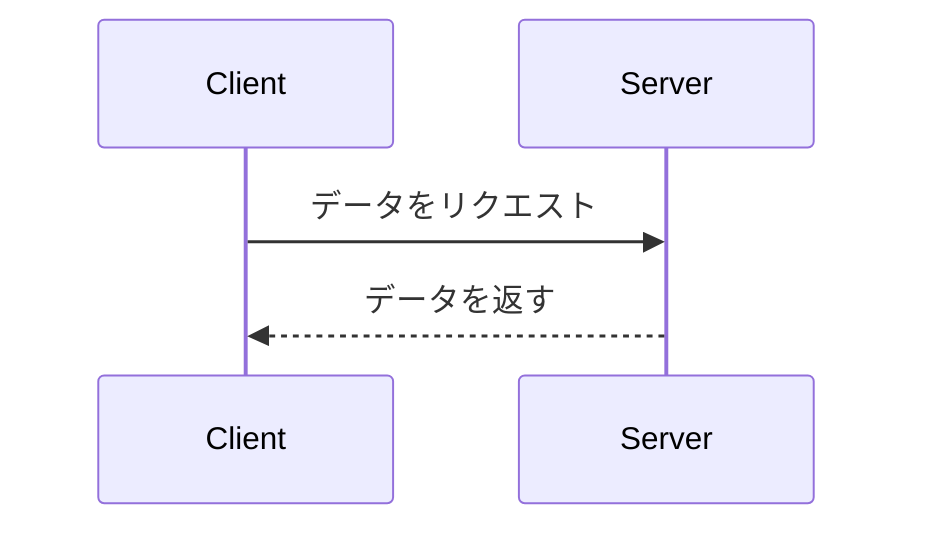
```mermaid
sequenceDiagram
    participant Client
    participant Server
    Client->>Server: データをリクエスト
    Server-->>Client: データを返す
```

**用途**: 同期メッセージ、リクエスト

### 破線矢印（`-->`）

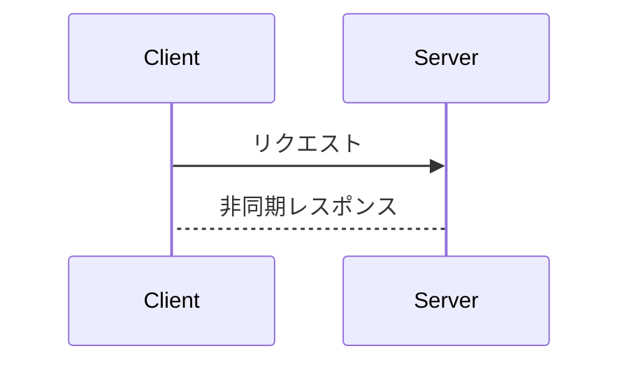
```mermaid
sequenceDiagram
    participant Client
    participant Server
    Client->>Server: リクエスト
    Server-->Client: 非同期レスポンス
```

**用途**: 非同期メッセージ、戻り値、レスポンス

### 塗りつぶし矢印（`->>`と`-->>`）

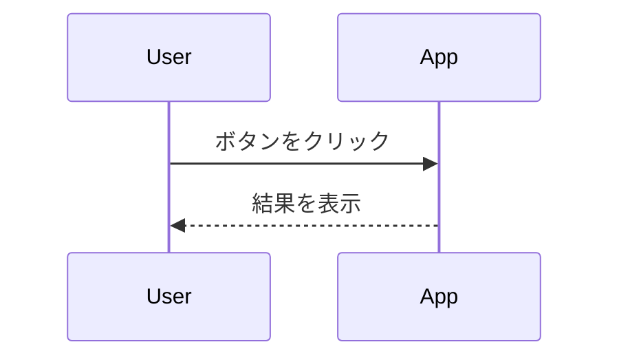
```mermaid
sequenceDiagram
    participant User
    participant App
    User->>App: ボタンをクリック
    App-->>User: 結果を表示
```

**用途**: 同期（`->>`）と非同期（`-->>`）メッセージの強調

### クロス矢印（`-x`と`--x`）

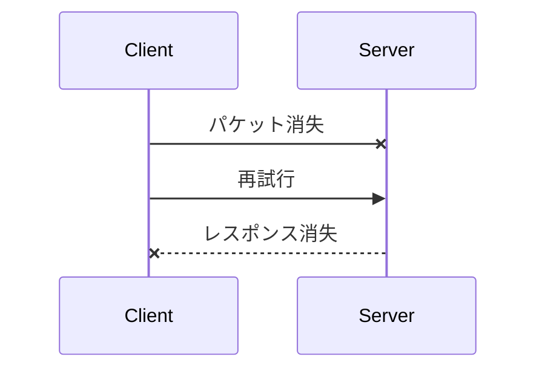
```mermaid
sequenceDiagram
    participant Client
    participant Server
    Client-xServer: パケット消失
    Client->>Server: 再試行
    Server--xClient: レスポンス消失
```

**用途**: 消失メッセージ、失敗、ネットワークエラー

### 開いた矢印（`-)`と`--)`）

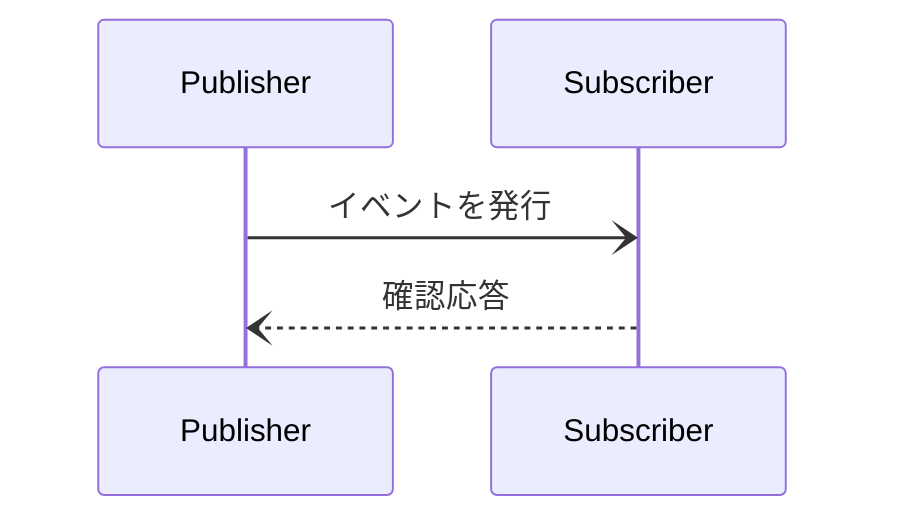
```mermaid
sequenceDiagram
    participant Publisher
    participant Subscriber
    Publisher-)Subscriber: イベントを発行
    Subscriber--)Publisher: 確認応答
```

**用途**: 非同期メッセージング、イベント駆動通信

---

## 2. 制御構造

### alt / else（条件分岐）

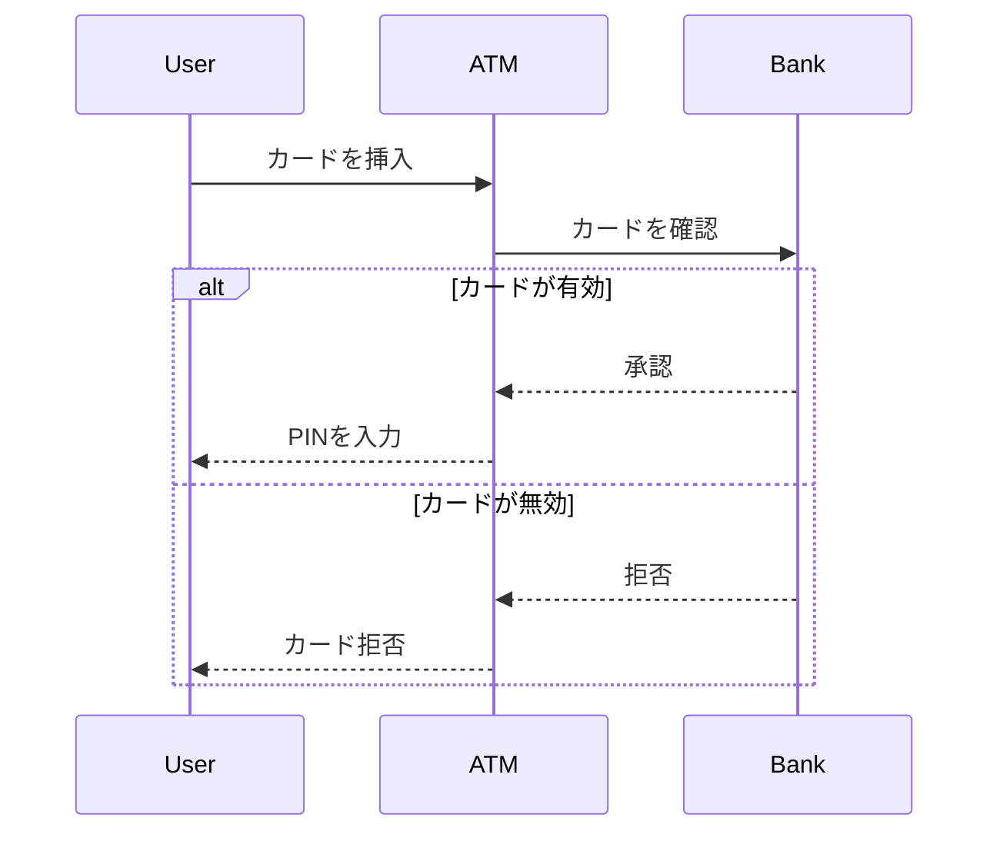
```mermaid
sequenceDiagram
    participant User
    participant ATM
    participant Bank
    
    User->>ATM: カードを挿入
    ATM->>Bank: カードを確認
    
    alt カードが有効
        Bank-->>ATM: 承認
        ATM-->>User: PINを入力
    else カードが無効
        Bank-->>ATM: 拒否
        ATM-->>User: カード拒否
    end
```

**用途**: 条件分岐（if/else ロジック）

### opt（オプション）

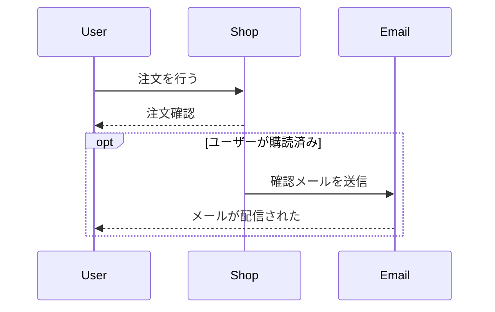
```mermaid
sequenceDiagram
    participant User
    participant Shop
    participant Email
    
    User->>Shop: 注文を行う
    Shop-->>User: 注文確認
    
    opt ユーザーが購読済み
        Shop->>Email: 確認メールを送信
        Email-->>User: メールが配信された
    end
```

**用途**: オプション実行（条件が真の場合のみ実行）

### loop（ループ）

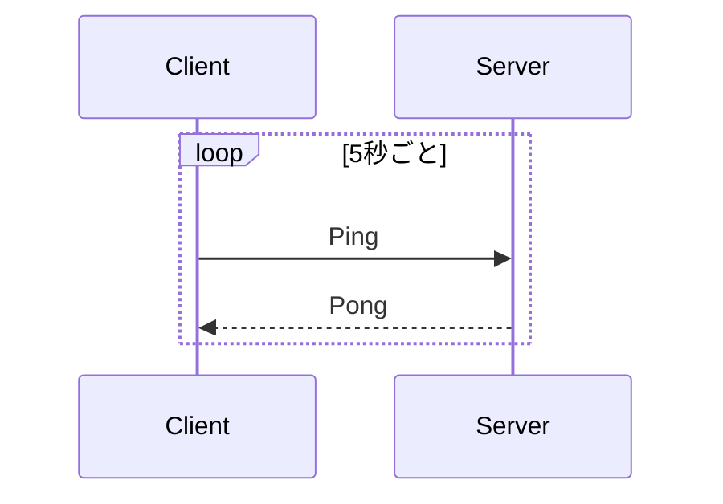
```mermaid
sequenceDiagram
    participant Client
    participant Server
    
    loop 5秒ごと
        Client->>Server: Ping
        Server-->>Client: Pong
    end
```

**用途**: 繰り返し実行、ポーリング、再試行

### par（並行処理）

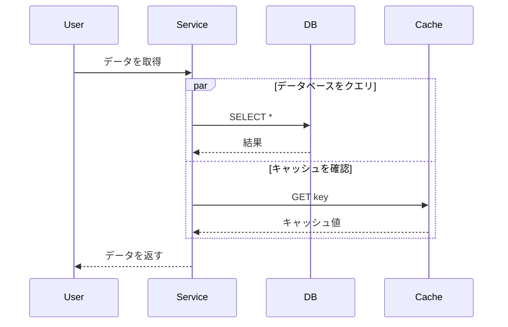
```mermaid
sequenceDiagram
    participant User
    participant Service
    participant DB
    participant Cache
    
    User->>Service: データを取得
    
    par データベースをクエリ
        Service->>DB: SELECT *
        DB-->>Service: 結果
    and キャッシュを確認
        Service->>Cache: GET key
        Cache-->>Service: キャッシュ値
    end
    
    Service-->>User: データを返す
```

**用途**: 並行/同時実行操作

### critical（クリティカルセクション）

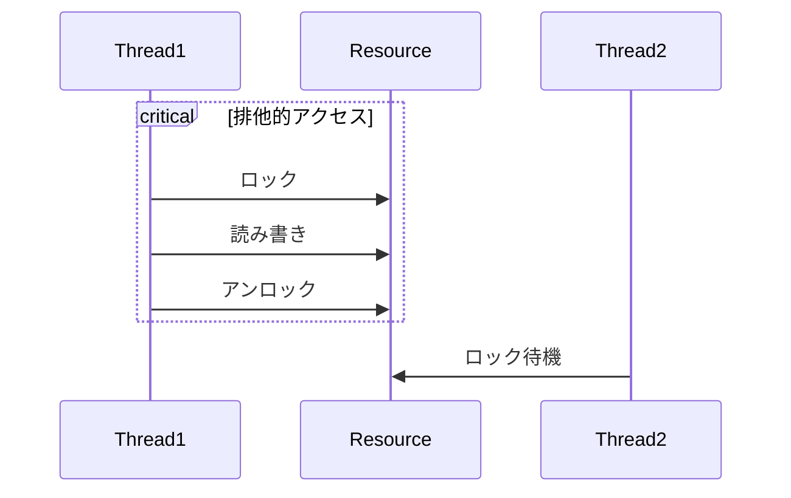
```mermaid
sequenceDiagram
    participant Thread1
    participant Resource
    participant Thread2
    
    critical 排他的アクセス
        Thread1->>Resource: ロック
        Thread1->>Resource: 読み書き
        Thread1->>Resource: アンロック
    end
    
    Thread2->>Resource: ロック待機
```

**用途**: クリティカルセクション、排他制御、ロック

### break（中断）

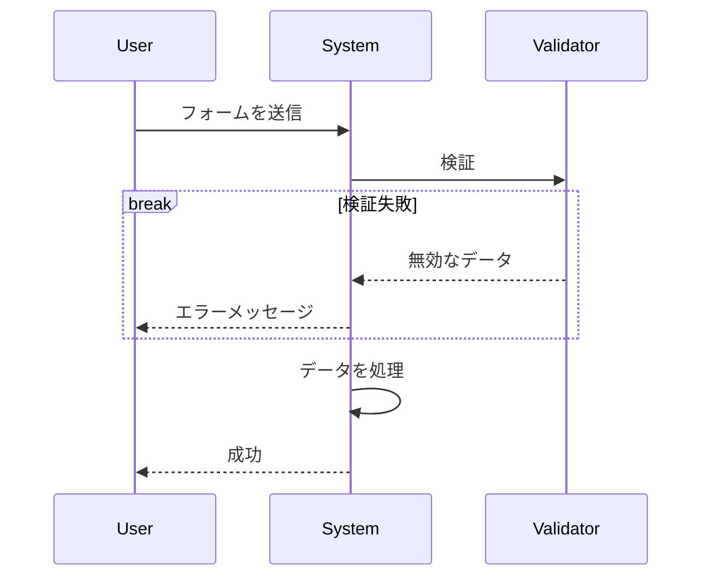
```mermaid
sequenceDiagram
    participant User
    participant System
    participant Validator
    
    User->>System: フォームを送信
    System->>Validator: 検証
    
    break 検証失敗
        Validator-->>System: 無効なデータ
        System-->>User: エラーメッセージ
    end
    
    System->>System: データを処理
    System-->>User: 成功
```

**用途**: 早期終了、エラーハンドリング

### rect（矩形/グループ化）

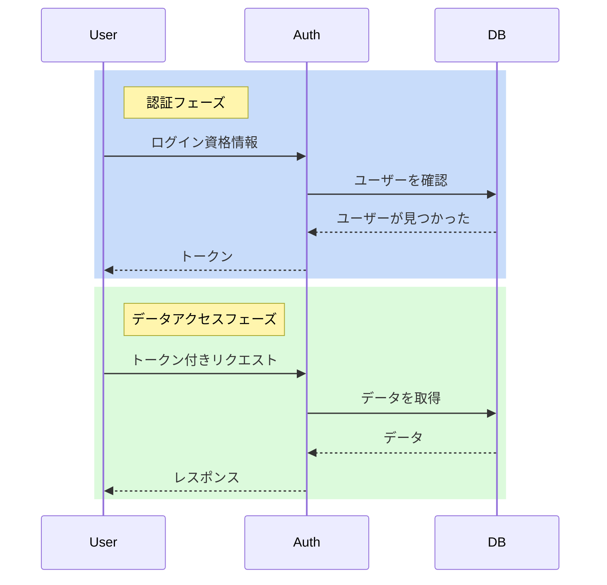
```mermaid
sequenceDiagram
    participant User
    participant Auth
    participant DB
    
    rect rgb(200, 220, 250)
    Note right of User: 認証フェーズ
    User->>Auth: ログイン資格情報
    Auth->>DB: ユーザーを確認
    DB-->>Auth: ユーザーが見つかった
    Auth-->>User: トークン
    end
    
    rect rgb(220, 250, 220)
    Note right of User: データアクセスフェーズ
    User->>Auth: トークン付きリクエスト
    Auth->>DB: データを取得
    DB-->>Auth: データ
    Auth-->>User: レスポンス
    end
```

**用途**: 視覚的グループ化、フェーズ分離、セクションの強調

---

## 3. 参加者

### participant vs actor

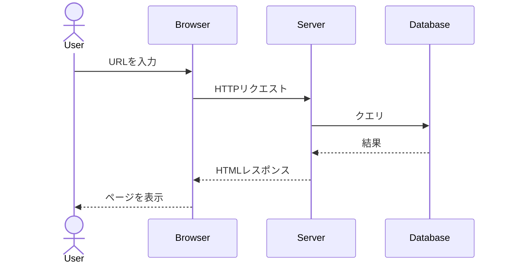
```mermaid
sequenceDiagram
    actor User
    participant Browser
    participant Server
    participant Database
    
    User->>Browser: URLを入力
    Browser->>Server: HTTPリクエスト
    Server->>Database: クエリ
    Database-->>Server: 結果
    Server-->>Browser: HTMLレスポンス
    Browser-->>User: ページを表示
```

**用途**: 
- `actor`: 人間のユーザー（人アイコンで表示）
- `participant`: システム、サービス、コンポーネント

---

## 4. activate（ライフライン）

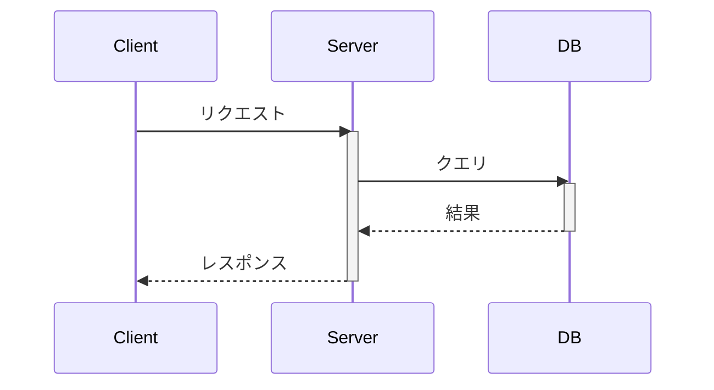
```mermaid
sequenceDiagram
    participant Client
    participant Server
    participant DB
    
    Client->>Server: リクエスト
    activate Server
    
    Server->>DB: クエリ
    activate DB
    DB-->>Server: 結果
    deactivate DB
    
    Server-->>Client: レスポンス
    deactivate Server
```

**用途**: 参加者がアクティブに処理している時を表示

### ネストされた activate

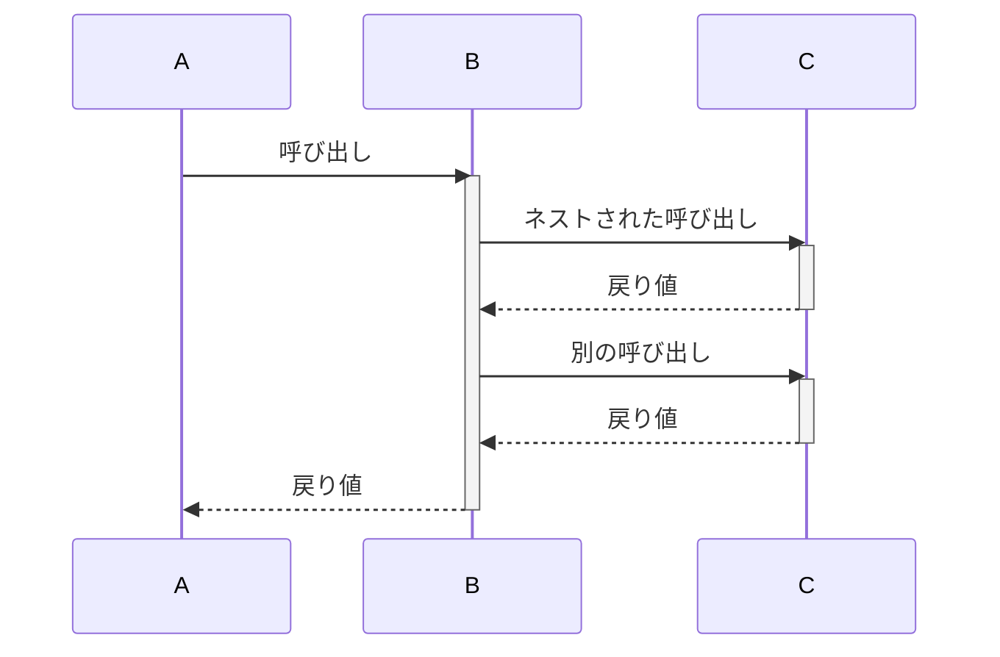
```mermaid
sequenceDiagram
    participant A
    participant B
    participant C
    
    A->>B: 呼び出し
    activate B
    
    B->>C: ネストされた呼び出し
    activate C
    C-->>B: 戻り値
    deactivate C
    
    B->>C: 別の呼び出し
    activate C
    C-->>B: 戻り値
    deactivate C
    
    B-->>A: 戻り値
    deactivate B
```

**用途**: ネストされたメソッド呼び出し、再帰操作

---

## 5. Note（ノート）

### Note の位置

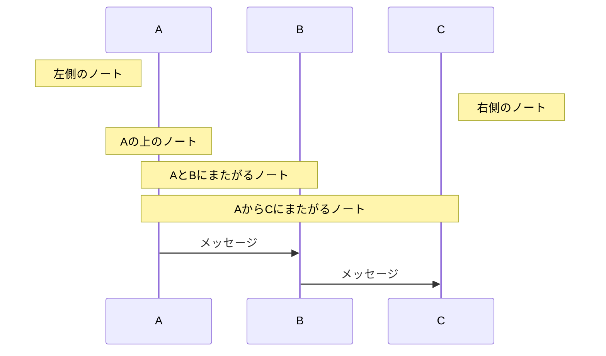
```mermaid
sequenceDiagram
    participant A
    participant B
    participant C
    
    Note left of A: 左側のノート
    Note right of C: 右側のノート
    Note over A: Aの上のノート
    Note over A,B: AとBにまたがるノート
    Note over A,C: AからCにまたがるノート
    
    A->>B: メッセージ
    B->>C: メッセージ
```

**用途**: コメント、説明、ドキュメント追加

---

## 6. autonumber（自動番号付け）

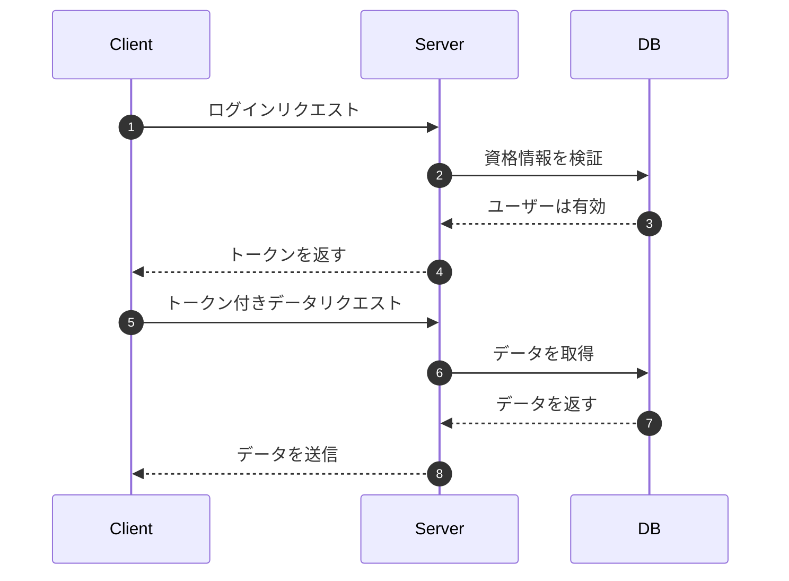
```mermaid
sequenceDiagram
    autonumber
    
    participant Client
    participant Server
    participant DB
    
    Client->>Server: ログインリクエスト
    Server->>DB: 資格情報を検証
    DB-->>Server: ユーザーは有効
    Server-->>Client: トークンを返す
    Client->>Server: トークン付きデータリクエスト
    Server->>DB: データを取得
    DB-->>Server: データを返す
    Server-->>Client: データを送信
```

**用途**: メッセージに自動的に番号を付ける

---

## 7. create と destroy

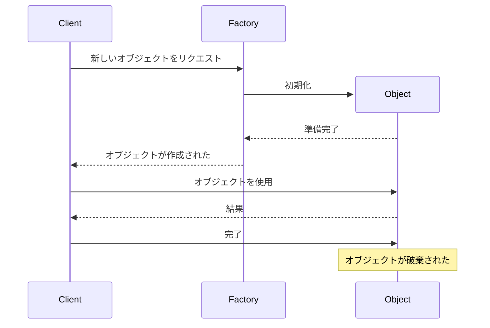
```mermaid
sequenceDiagram
    participant Client
    participant Factory
    
    Client->>Factory: 新しいオブジェクトをリクエスト
    create participant Object
    Factory->>Object: 初期化
    Object-->>Factory: 準備完了
    Factory-->>Client: オブジェクトが作成された
    
    Client->>Object: オブジェクトを使用
    Object-->>Client: 結果
    
    Client->>Object: 完了
    destroy Object
    Note over Object: オブジェクトが破棄された
```

**用途**: オブジェクト/参加者のライフサイクルを表示

---

## 8. 複合例：オンラインショッピング

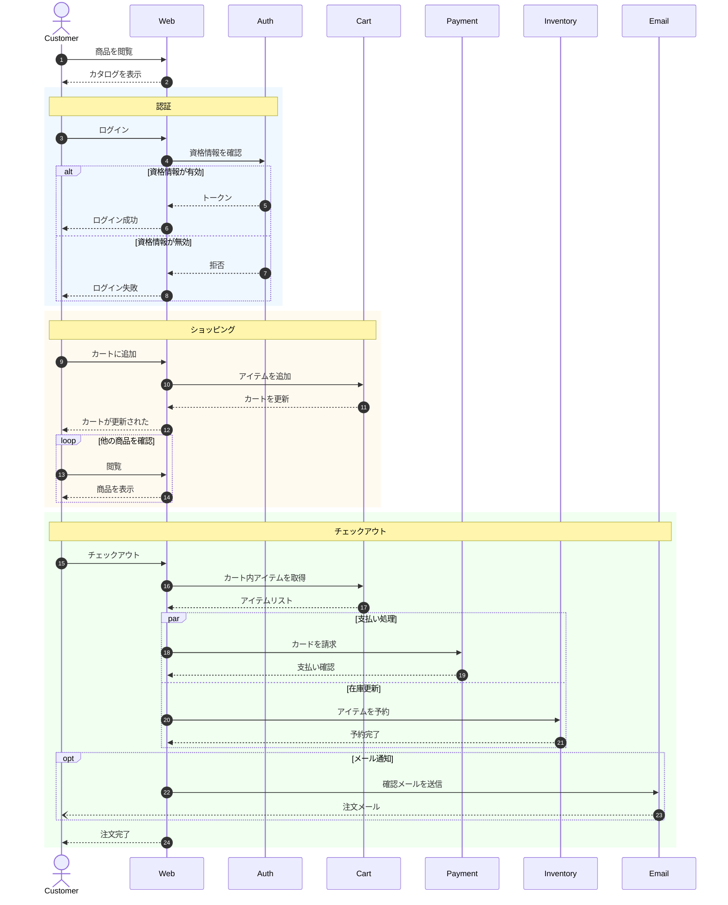
```mermaid
sequenceDiagram
    autonumber
    actor Customer
    participant Web
    participant Auth
    participant Cart
    participant Payment
    participant Inventory
    participant Email
    
    Customer->>Web: 商品を閲覧
    Web-->>Customer: カタログを表示
    
    rect rgb(240, 248, 255)
    Note over Customer,Auth: 認証
    Customer->>Web: ログイン
    Web->>Auth: 資格情報を確認
    
    alt 資格情報が有効
        Auth-->>Web: トークン
        Web-->>Customer: ログイン成功
    else 資格情報が無効
        Auth-->>Web: 拒否
        Web-->>Customer: ログイン失敗
    end
    end
    
    rect rgb(255, 250, 240)
    Note over Customer,Cart: ショッピング
    Customer->>Web: カートに追加
    Web->>Cart: アイテムを追加
    Cart-->>Web: カートを更新
    Web-->>Customer: カートが更新された
    
    loop 他の商品を確認
        Customer->>Web: 閲覧
        Web-->>Customer: 商品を表示
    end
    end
    
    rect rgb(240, 255, 240)
    Note over Customer,Email: チェックアウト
    Customer->>Web: チェックアウト
    Web->>Cart: カート内アイテムを取得
    Cart-->>Web: アイテムリスト
    
    par 支払い処理
        Web->>Payment: カードを請求
        Payment-->>Web: 支払い確認
    and 在庫更新
        Web->>Inventory: アイテムを予約
        Inventory-->>Web: 予約完了
    end
    
    opt メール通知
        Web->>Email: 確認メールを送信
        Email--)Customer: 注文メール
    end
    
    Web-->>Customer: 注文完了
    end
```

---

## 9. エラーハンドリングパターン

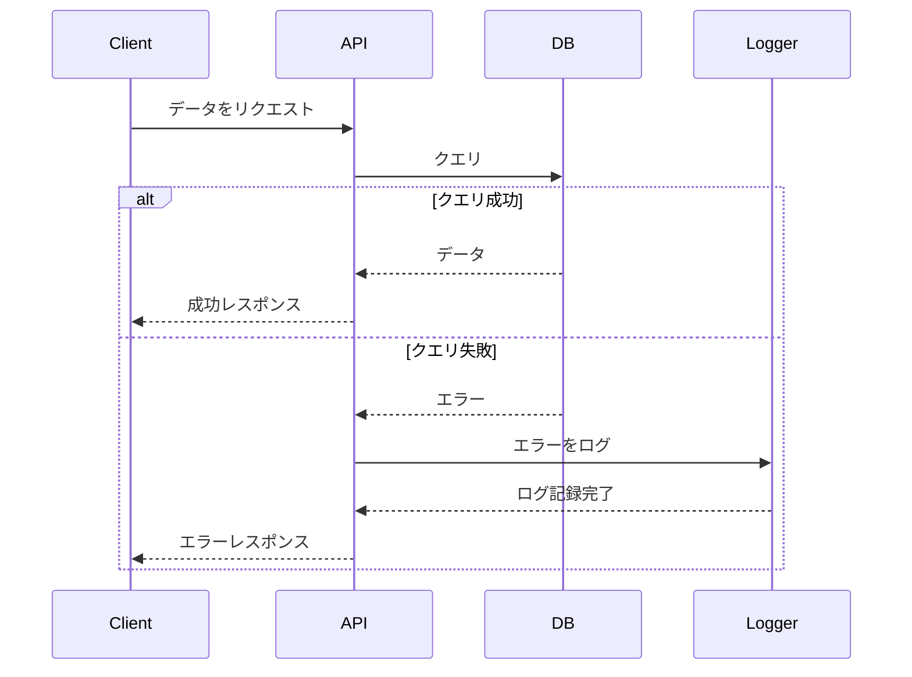
```mermaid
sequenceDiagram
    participant Client
    participant API
    participant DB
    participant Logger
    
    Client->>API: データをリクエスト
    API->>DB: クエリ
    
    alt クエリ成功
        DB-->>API: データ
        API-->>Client: 成功レスポンス
    else クエリ失敗
        DB-->>API: エラー
        API->>Logger: エラーをログ
        Logger-->>API: ログ記録完了
        API-->>Client: エラーレスポンス
    end
```

---

## 10. マイクロサービス通信

```mermaid
sequenceDiagram
    actor User
    participant Gateway
    participant AuthService
    participant UserService
    participant OrderService
    
    User->>Gateway: APIリクエスト
    Gateway->>AuthService: トークンを検証
    
    alt トークンが有効
        AuthService-->>Gateway: 認証済み
        
        Gateway->>UserService: ユーザーを取得
        UserService-->>Gateway: ユーザーデータ
        
        Gateway->>OrderService: 注文を取得
        OrderService-->>Gateway: 注文リスト
        
        Gateway-->>User: 統合レスポンス
        
    else トークンが無効
        AuthService-->>Gateway: 未認証
        Gateway-->>User: 401エラー
    end
```

---

## ヒント

1. **矢印の方向**: 常に左から右、または上から下に読む
2. **activate**: 処理時間とコールスタックを表示するために使用
3. **alt vs opt**: if/elseには`alt`、ifのみには`opt`を使用
4. **par**: 真に並行な操作（スレッド、非同期呼び出し）に使用
5. **critical**: 同期/ロックされたセクションに使用
6. **rect**: 視覚的な整理に使用、特に複雑な図で有効
7. **Note**: ビジネスロジックや技術的な詳細を説明するために使用
8. **autonumber**: レビューで特定のステップを議論する際に便利

---

© 2026 GoodRelax. MIT License.
