# Sequence Diagram Cheat Sheet
**How to Render**: Copy the Mermaid code from this cheat sheet and paste it into the top-right box on the site below, then click the (Render Light) or (Render Dark) button to display the diagram.
[gr-mm-render](https://goodrelax.github.io/gr_miscellaneous/gr-mm-render.html)

## Arrow Types Quick Reference

| Notation | Type | Description |
|----------|------|-------------|
| `->` | Solid arrow | Synchronous message (solid line) |
| `-->` | Dashed arrow | Asynchronous message / return (dashed line) |
| `->>` | Solid filled arrow | Synchronous message (filled arrowhead) |
| `-->>` | Dashed filled arrow | Asynchronous message / return (filled, dashed) |
| `-x` | Cross arrow | Lost message / failure (solid line with X) |
| `--x` | Dashed cross arrow | Lost message / failure (dashed line with X) |
| `-)` | Open arrow | Asynchronous message (solid line, open arrow) |
| `--)` | Dashed open arrow | Asynchronous return (dashed line, open arrow) |

## About Arrow Shapes

| Shape | Notation | Description |
|------|--------|------|
| Triangle arrow | `->`, `-->`, `->>`, `-->>` | Regular messages, method calls |
| Open arrow (parenthesis) | `-)`, `--)` | Asynchronous messages, event notifications (fire-and-forget) |
| Cross (X) | `-x`, `--x` | Lost messages, communication failures |

**Note**: Triangle and open arrows differ only in appearance; they function the same. In practice, `->` and `-->` are often sufficient.

**Example Team Conventions**: 
- Synchronous calls (waiting for response) → Triangle arrows `->`, `->>` 
- Asynchronous calls (fire-and-forget, event publishing) → Open arrows `-)`, `--)`
- No strict rules exist, so consistency within your team is what matters

## Control Structures Quick Reference

| Notation | Name | Description |
|----------|------|-------------|
| `alt` / `else` | Alternative | Conditional branching (if/else) |
| `opt` | Optional | Optional execution (if only) |
| `loop` | Loop | Repeated execution |
| `par` | Parallel | Parallel/concurrent execution |
| `critical` | Critical | Critical section (mutual exclusion) |
| `break` | Break | Break/interrupt flow |
| `rect` | Rectangle | Visual grouping of messages |

## Other Features

| Feature | Notation | Description |
|---------|----------|-------------|
| Participant | `participant A` | Define participant |
| Actor | `actor User` | Define actor (person icon) |
| Activation | `activate A` / `deactivate A` | Show active lifeline |
| Note | `Note right of A: text` | Add comment/note |
| Autonumber | `autonumber` | Automatic message numbering |
| Create | `create B` | Create new participant |
| Destroy | `destroy B` | Destroy participant |

---

## 1. Basic Arrows

### Solid Arrow (`->`)

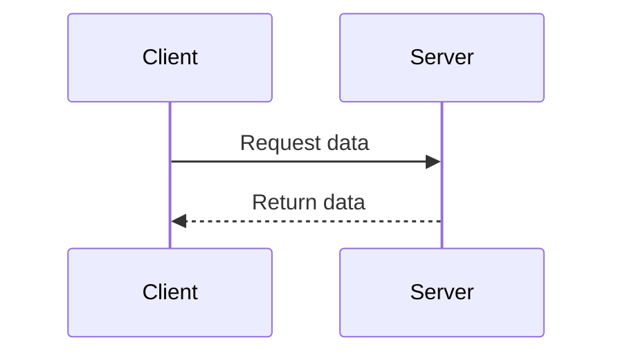
```mermaid
sequenceDiagram
    participant Client
    participant Server
    Client->>Server: Request data
    Server-->>Client: Return data
```

**Usage**: Synchronous messages, requests

### Dashed Arrow (`-->`)

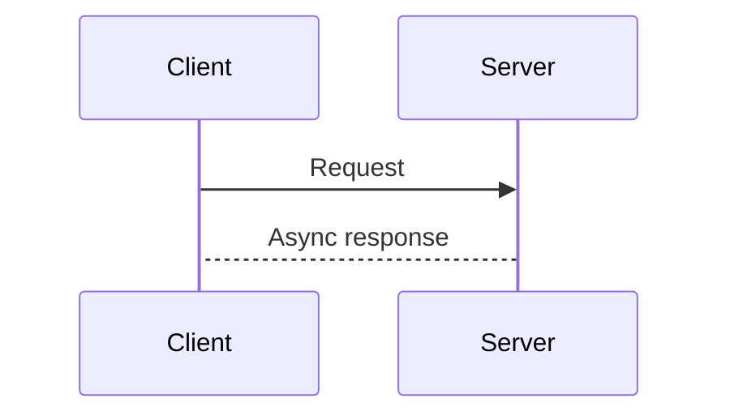
```mermaid
sequenceDiagram
    participant Client
    participant Server
    Client->>Server: Request
    Server-->Client: Async response
```

**Usage**: Asynchronous messages, return values, responses

### Filled Arrows (`->>` and `-->>`)

```mermaid
sequenceDiagram
    participant User
    participant App
    User->>App: Click button
    App-->>User: Show result
```

**Usage**: Emphasis on synchronous (`->>`) and asynchronous (`-->>`) messages

### Cross Arrows (`-x` and `--x`)

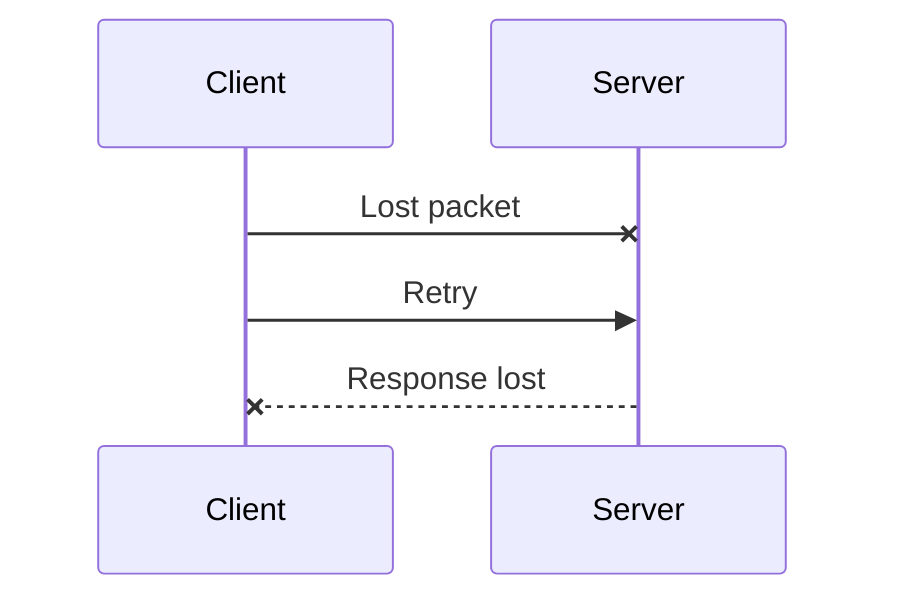
```mermaid
sequenceDiagram
    participant Client
    participant Server
    Client-xServer: Lost packet
    Client->>Server: Retry
    Server--xClient: Response lost
```

**Usage**: Lost messages, failures, network errors

### Open Arrows (`-)` and `---)`)

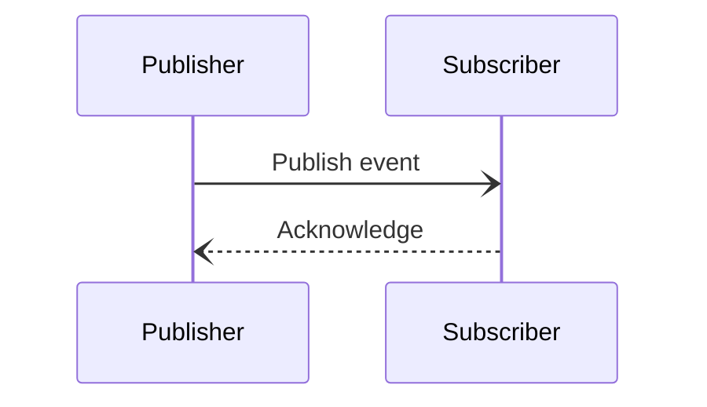
```mermaid
sequenceDiagram
    participant Publisher
    participant Subscriber
    Publisher-)Subscriber: Publish event
    Subscriber--)Publisher: Acknowledge
```

**Usage**: Asynchronous messaging, event-driven communication

---

## 2. Control Structures

### alt / else (Conditional)

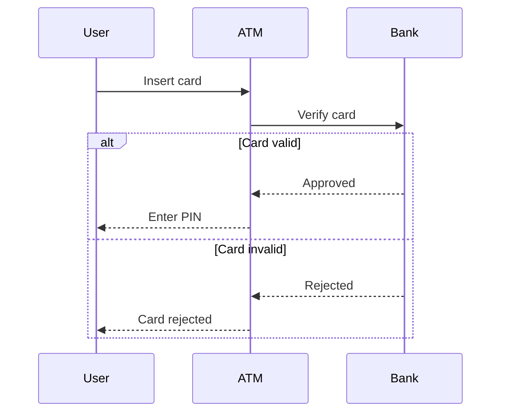
```mermaid
sequenceDiagram
    participant User
    participant ATM
    participant Bank
    
    User->>ATM: Insert card
    ATM->>Bank: Verify card
    
    alt Card valid
        Bank-->>ATM: Approved
        ATM-->>User: Enter PIN
    else Card invalid
        Bank-->>ATM: Rejected
        ATM-->>User: Card rejected
    end
```

**Usage**: Conditional branching (if/else logic)

### opt (Optional)

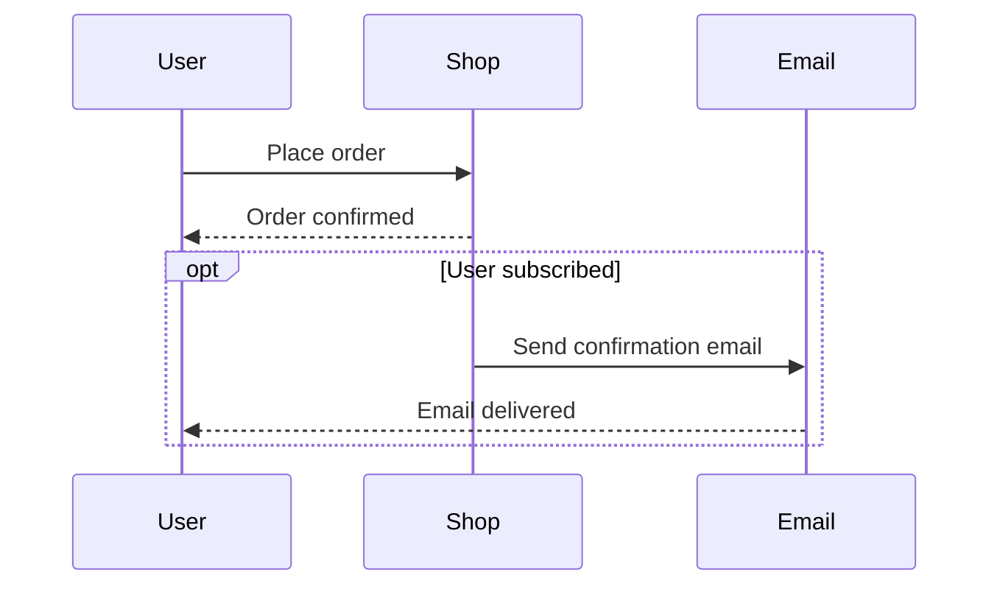
```mermaid
sequenceDiagram
    participant User
    participant Shop
    participant Email
    
    User->>Shop: Place order
    Shop-->>User: Order confirmed
    
    opt User subscribed
        Shop->>Email: Send confirmation email
        Email-->>User: Email delivered
    end
```

**Usage**: Optional execution (executed only if condition is true)

### loop

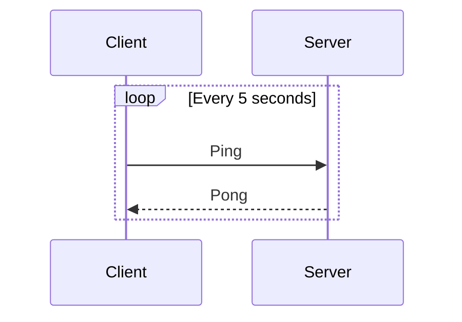
```mermaid
sequenceDiagram
    participant Client
    participant Server
    
    loop Every 5 seconds
        Client->>Server: Ping
        Server-->>Client: Pong
    end
```

**Usage**: Repeated execution, polling, retries

### par (Parallel)

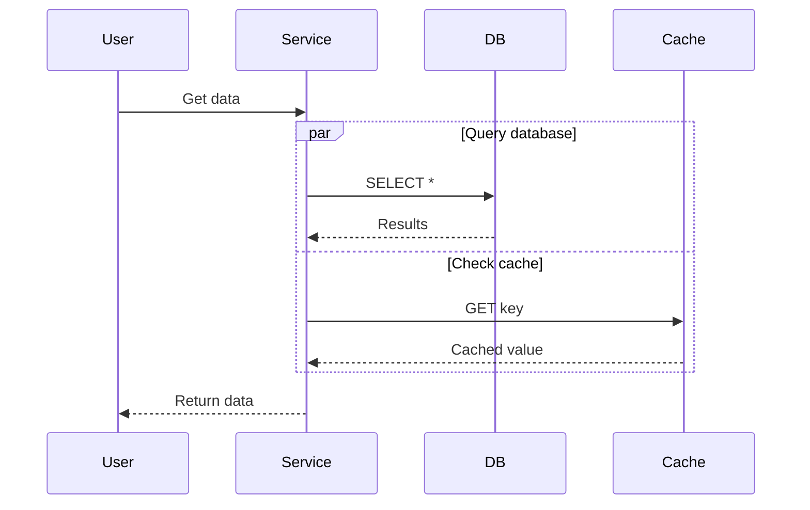
```mermaid
sequenceDiagram
    participant User
    participant Service
    participant DB
    participant Cache
    
    User->>Service: Get data
    
    par Query database
        Service->>DB: SELECT *
        DB-->>Service: Results
    and Check cache
        Service->>Cache: GET key
        Cache-->>Service: Cached value
    end
    
    Service-->>User: Return data
```

**Usage**: Parallel/concurrent operations

### critical

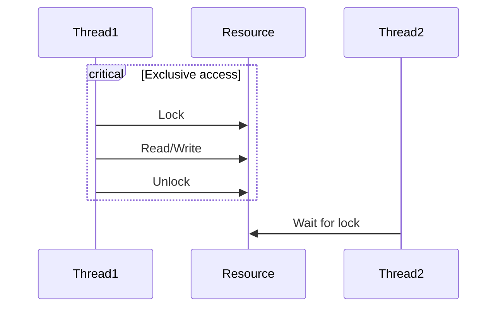
```mermaid
sequenceDiagram
    participant Thread1
    participant Resource
    participant Thread2
    
    critical Exclusive access
        Thread1->>Resource: Lock
        Thread1->>Resource: Read/Write
        Thread1->>Resource: Unlock
    end
    
    Thread2->>Resource: Wait for lock
```

**Usage**: Critical sections, mutual exclusion, locking

### break

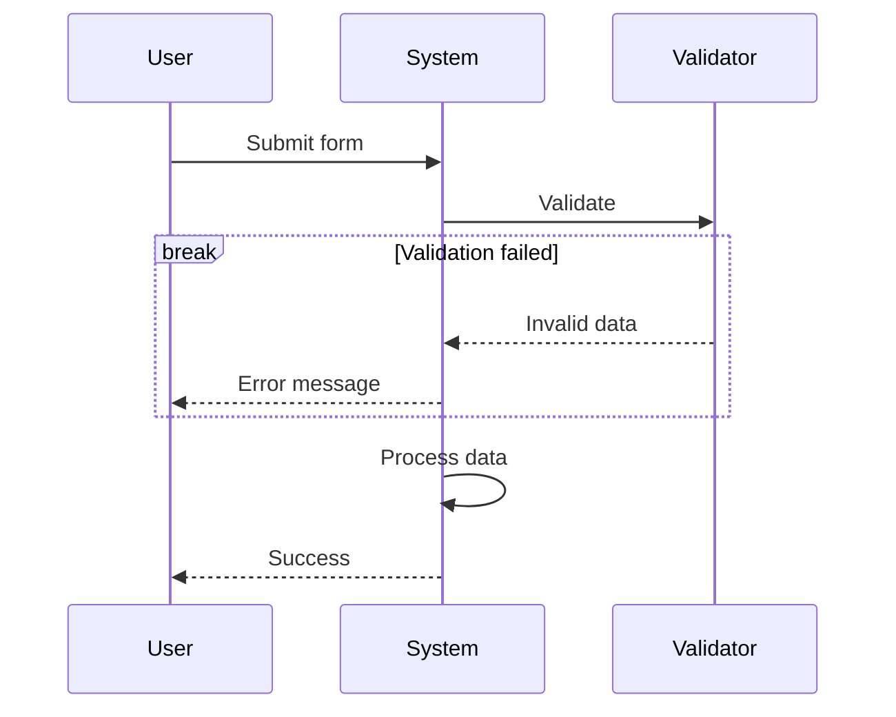
```mermaid
sequenceDiagram
    participant User
    participant System
    participant Validator
    
    User->>System: Submit form
    System->>Validator: Validate
    
    break Validation failed
        Validator-->>System: Invalid data
        System-->>User: Error message
    end
    
    System->>System: Process data
    System-->>User: Success
```

**Usage**: Early termination, error handling

### rect (Rectangle/Grouping)

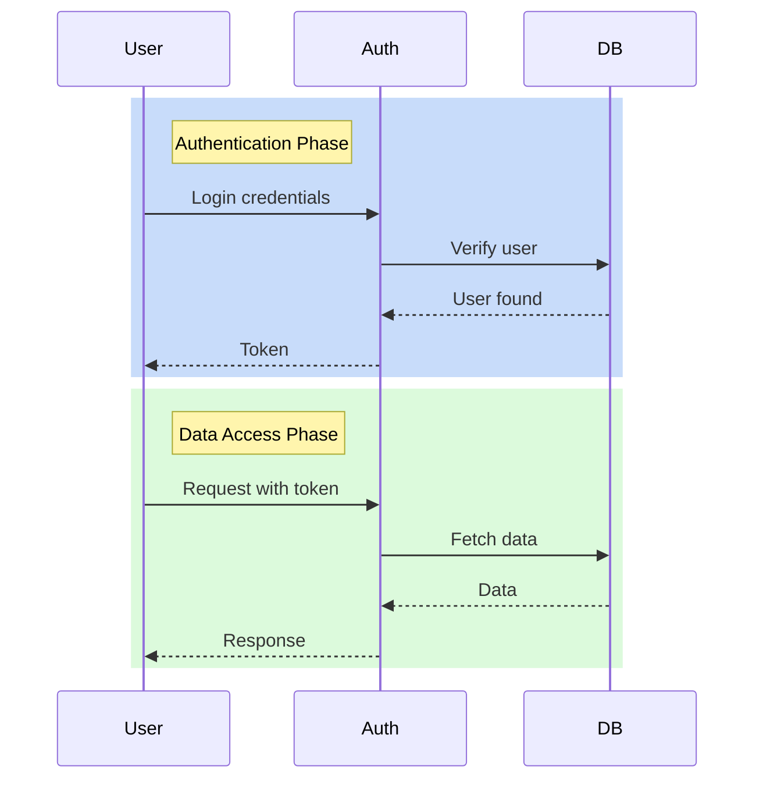
```mermaid
sequenceDiagram
    participant User
    participant Auth
    participant DB
    
    rect rgb(200, 220, 250)
    Note right of User: Authentication Phase
    User->>Auth: Login credentials
    Auth->>DB: Verify user
    DB-->>Auth: User found
    Auth-->>User: Token
    end
    
    rect rgb(220, 250, 220)
    Note right of User: Data Access Phase
    User->>Auth: Request with token
    Auth->>DB: Fetch data
    DB-->>Auth: Data
    Auth-->>User: Response
    end
```

**Usage**: Visual grouping, phase separation, highlighting sections

---

## 3. Participants

### Participant vs Actor

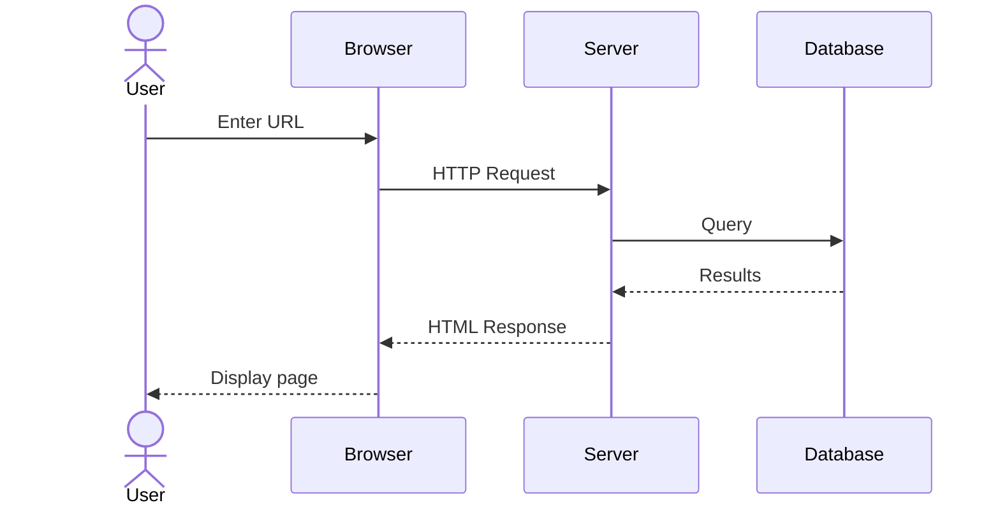
```mermaid
sequenceDiagram
    actor User
    participant Browser
    participant Server
    participant Database
    
    User->>Browser: Enter URL
    Browser->>Server: HTTP Request
    Server->>Database: Query
    Database-->>Server: Results
    Server-->>Browser: HTML Response
    Browser-->>User: Display page
```

**Usage**: 
- `actor`: Human users (shown with person icon)
- `participant`: Systems, services, components

---

## 4. Activation (Lifeline)

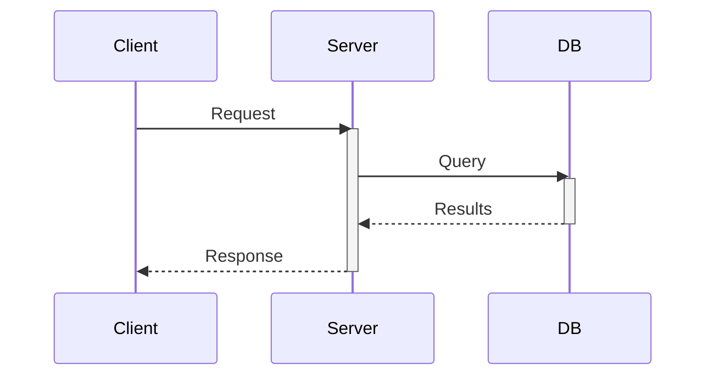
```mermaid
sequenceDiagram
    participant Client
    participant Server
    participant DB
    
    Client->>Server: Request
    activate Server
    
    Server->>DB: Query
    activate DB
    DB-->>Server: Results
    deactivate DB
    
    Server-->>Client: Response
    deactivate Server
```

**Usage**: Show when a participant is actively processing

### Nested Activation

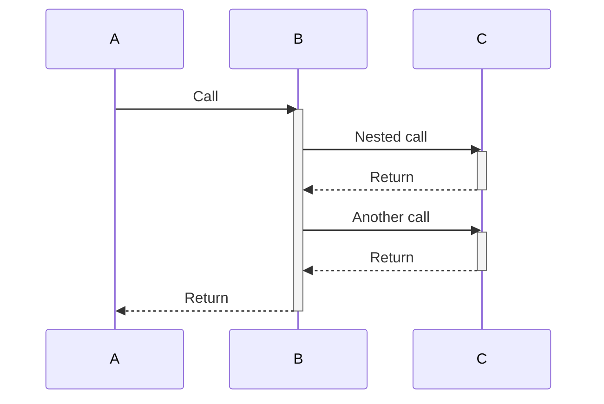
```mermaid
sequenceDiagram
    participant A
    participant B
    participant C
    
    A->>B: Call
    activate B
    
    B->>C: Nested call
    activate C
    C-->>B: Return
    deactivate C
    
    B->>C: Another call
    activate C
    C-->>B: Return
    deactivate C
    
    B-->>A: Return
    deactivate B
```

**Usage**: Nested method calls, recursive operations

---

## 5. Notes

### Note Positions

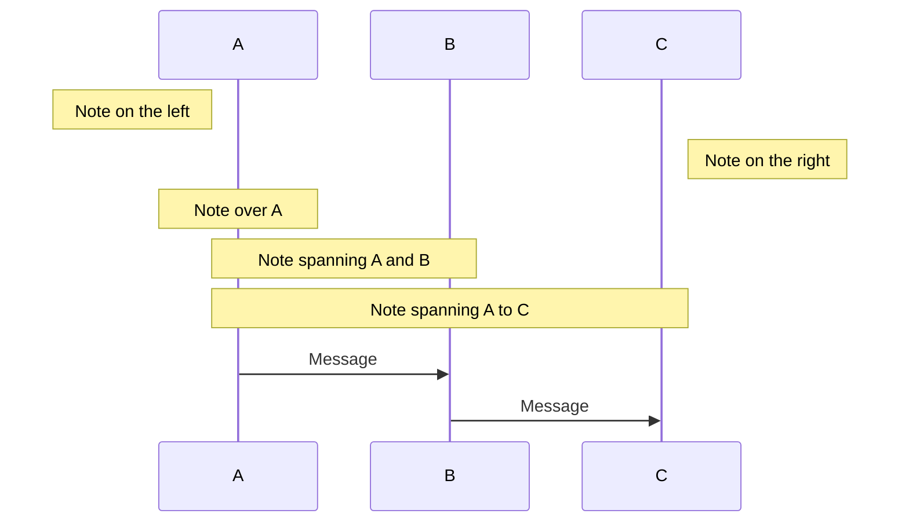
```mermaid
sequenceDiagram
    participant A
    participant B
    participant C
    
    Note left of A: Note on the left
    Note right of C: Note on the right
    Note over A: Note over A
    Note over A,B: Note spanning A and B
    Note over A,C: Note spanning A to C
    
    A->>B: Message
    B->>C: Message
```

**Usage**: Add comments, explanations, documentation

---

## 6. Autonumbering

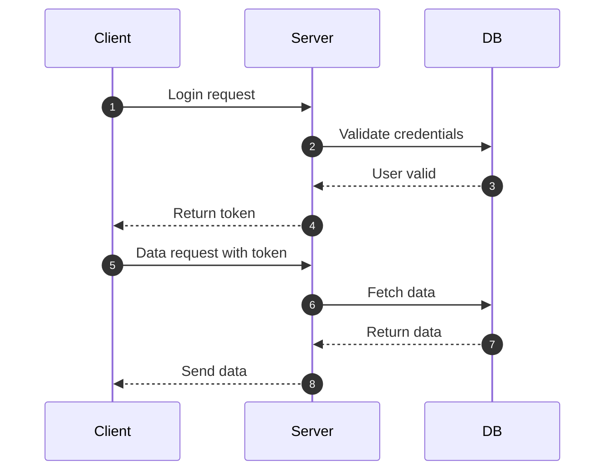
```mermaid
sequenceDiagram
    autonumber
    
    participant Client
    participant Server
    participant DB
    
    Client->>Server: Login request
    Server->>DB: Validate credentials
    DB-->>Server: User valid
    Server-->>Client: Return token
    Client->>Server: Data request with token
    Server->>DB: Fetch data
    DB-->>Server: Return data
    Server-->>Client: Send data
```

**Usage**: Automatically number messages in sequence

---

## 7. Create and Destroy

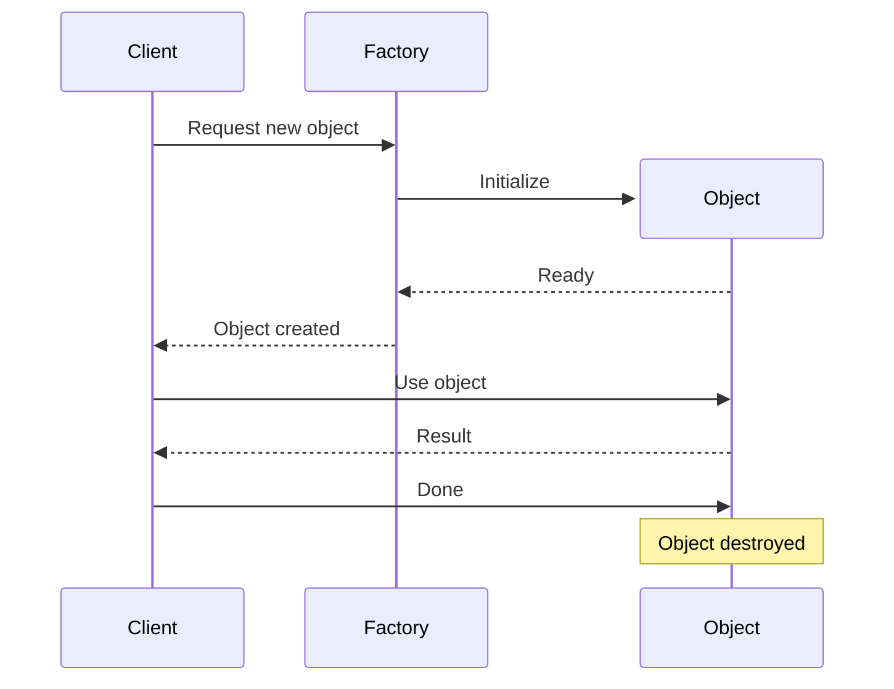
```mermaid
sequenceDiagram
    participant Client
    participant Factory
    
    Client->>Factory: Request new object
    create participant Object
    Factory->>Object: Initialize
    Object-->>Factory: Ready
    Factory-->>Client: Object created
    
    Client->>Object: Use object
    Object-->>Client: Result
    
    Client->>Object: Done
    destroy Object
    Note over Object: Object destroyed
```

**Usage**: Show lifecycle of objects/participants

---

## 8. Complex Example: Online Shopping

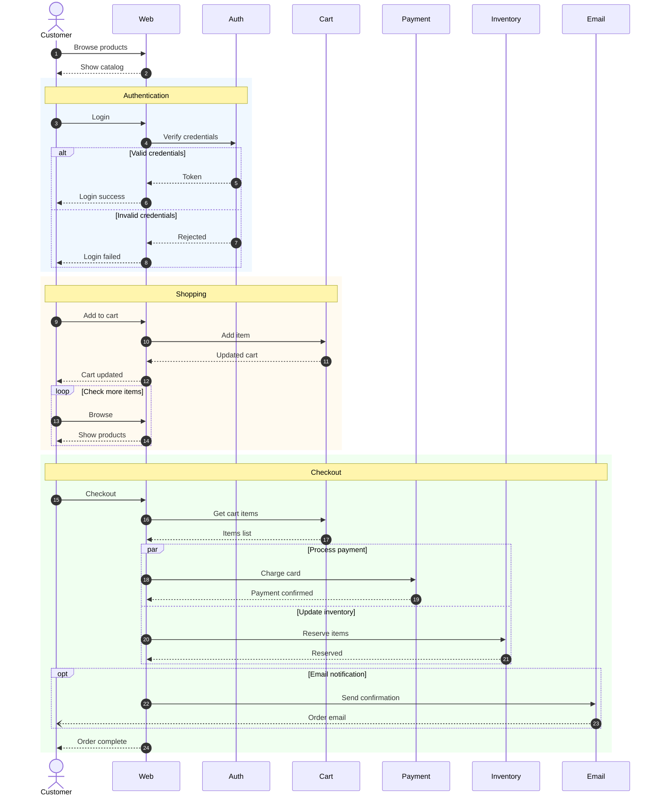
```mermaid
sequenceDiagram
    autonumber
    actor Customer
    participant Web
    participant Auth
    participant Cart
    participant Payment
    participant Inventory
    participant Email
    
    Customer->>Web: Browse products
    Web-->>Customer: Show catalog
    
    rect rgb(240, 248, 255)
    Note over Customer,Auth: Authentication
    Customer->>Web: Login
    Web->>Auth: Verify credentials
    
    alt Valid credentials
        Auth-->>Web: Token
        Web-->>Customer: Login success
    else Invalid credentials
        Auth-->>Web: Rejected
        Web-->>Customer: Login failed
    end
    end
    
    rect rgb(255, 250, 240)
    Note over Customer,Cart: Shopping
    Customer->>Web: Add to cart
    Web->>Cart: Add item
    Cart-->>Web: Updated cart
    Web-->>Customer: Cart updated
    
    loop Check more items
        Customer->>Web: Browse
        Web-->>Customer: Show products
    end
    end
    
    rect rgb(240, 255, 240)
    Note over Customer,Email: Checkout
    Customer->>Web: Checkout
    Web->>Cart: Get cart items
    Cart-->>Web: Items list
    
    par Process payment
        Web->>Payment: Charge card
        Payment-->>Web: Payment confirmed
    and Update inventory
        Web->>Inventory: Reserve items
        Inventory-->>Web: Reserved
    end
    
    opt Email notification
        Web->>Email: Send confirmation
        Email--)Customer: Order email
    end
    
    Web-->>Customer: Order complete
    end
```

---

## 9. Error Handling Pattern

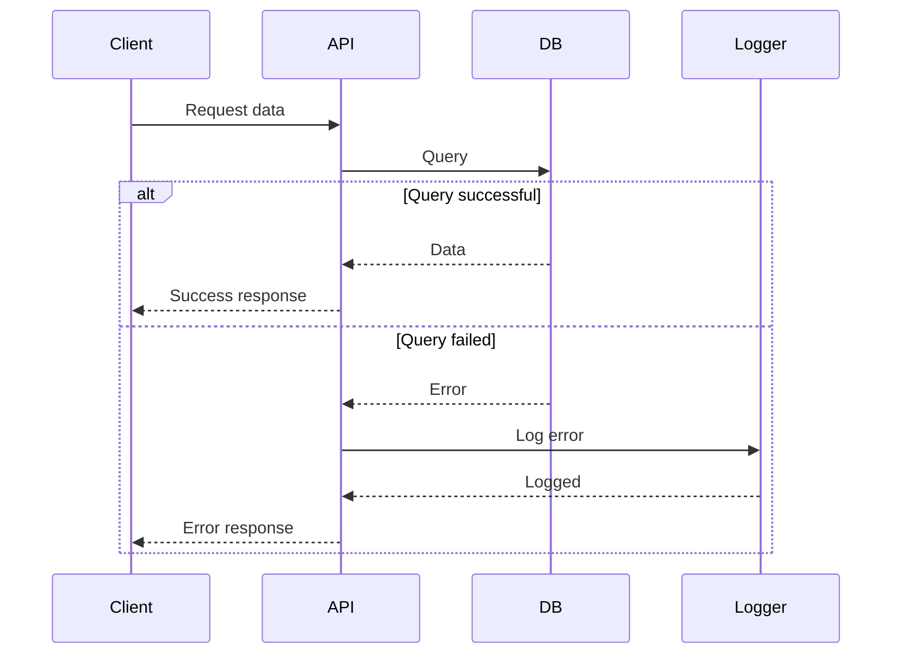
```mermaid
sequenceDiagram
    participant Client
    participant API
    participant DB
    participant Logger
    
    Client->>API: Request data
    API->>DB: Query
    
    alt Query successful
        DB-->>API: Data
        API-->>Client: Success response
    else Query failed
        DB-->>API: Error
        API->>Logger: Log error
        Logger-->>API: Logged
        API-->>Client: Error response
    end
```

---

## 10. Microservices Communication

```mermaid
sequenceDiagram
    actor User
    participant Gateway
    participant AuthService
    participant UserService
    participant OrderService
    
    User->>Gateway: API Request
    Gateway->>AuthService: Validate token
    
    alt Token valid
        AuthService-->>Gateway: Authorized
        
        Gateway->>UserService: Get user
        UserService-->>Gateway: User data
        
        Gateway->>OrderService: Get orders
        OrderService-->>Gateway: Order list
        
        Gateway-->>User: Combined response
        
    else Token invalid
        AuthService-->>Gateway: Unauthorized
        Gateway-->>User: 401 Error
    end
```

---

## Tips

1. **Arrow Direction**: Always read from left to right or top to bottom
2. **Activation**: Use for showing processing time and call stacks
3. **alt vs opt**: Use `alt` for if/else, `opt` for if-only
4. **par**: For truly concurrent operations (threading, async calls)
5. **critical**: For synchronized/locked sections
6. **rect**: For visual organization, especially in complex diagrams
7. **Notes**: Use to explain business logic or technical details
8. **Autonumber**: Helpful for discussing specific steps in reviews

---

© 2026 GoodRelax. MIT License.
